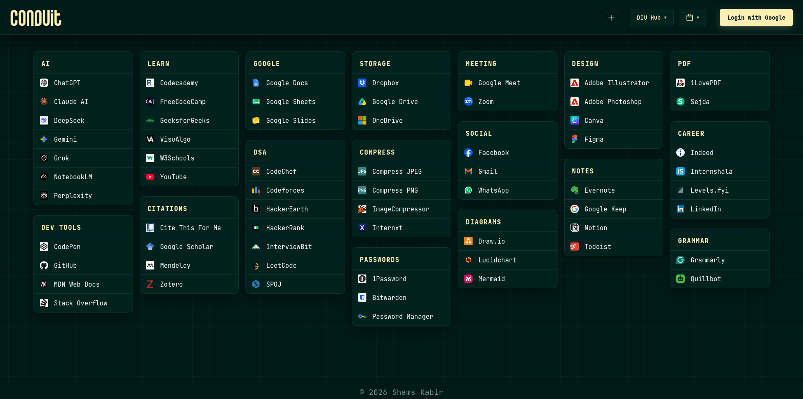

# Conduit

A clean, distraction-free study space for DIU students — everything you need for a productive session, in one browser tab.



**Live demo:** [shams-27.github.io/conduit](https://shams-27.github.io/conduit/)

---

## Table of Contents

- [Overview](#overview)
- [Features](#features)
- [Tech Stack](#tech-stack)
- [Project Structure](#project-structure)
- [Getting Started](#getting-started)
- [Deploying Your Own Instance](#deploying-your-own-instance)
- [Contributing](#contributing)
- [License](#license)

---

## Overview

Conduit is a personal browser start page built around the daily workflow of a DIU (Daffodil International University) student. Instead of hunting across tabs for the Student Portal, BLC, or study tools, Conduit brings everything onto a single, organized page — complete with a custom bookmark manager and Google-account sync, so your setup follows you across devices.

## Features

| Feature | Description |
|---|---|
| **DIU Hub** | One-click access to the Student Portal, BLC, Campus Schedule, DIU Routine, Notice Board, and Academic Calendar |
| **Organized Study Links** | Curated sections for AI Assistants, Learning & Media, Google Tools, Toolbox, Communication, and Career resources |
| **Custom Bookmarks** | Add your own links through a simple modal — saved and ready every session |
| **Google Sync** | Sign in with Google to sync custom bookmarks across all your devices |
| **Guest Mode** | No login required — links are stored locally until you're ready to sync |
| **Distraction-Free** | No ads, no feeds, no noise — just your tools |

## Tech Stack

| Layer | Technology |
|---|---|
| Markup | HTML5 |
| Styling | CSS3 |
| Logic | Vanilla JavaScript (ES6) |
| Auth & Sync | Google OAuth / Firebase |
| Hosting | GitHub Pages |

## Project Structure

```
conduit/
├── index.html      # Layout and bookmark sections
├── style.css       # Styling and responsive design
├── script.js       # Auth, sync, and bookmark logic
├── fonts/          # Custom font assets
└── cursors/        # Custom cursor assets
```

## Getting Started

Conduit has no build step and no external dependencies.

### Clone the repository

```bash
git clone https://github.com/shams-27/conduit.git
cd conduit
```

### Run locally

You can open `index.html` directly in a browser to preview the layout. However, **Google login requires an HTTP/HTTPS context**, so for full functionality serve the project locally instead:

```bash
# Using Python
python -m http.server 8080

# Using Node
npx serve .
```

Then visit `http://localhost:8080` in your browser.

## Deploying Your Own Instance

1. Fork this repository.
2. Go to **Settings → Pages** in your fork.
3. Set the source to the `main` branch, root (`/`) directory.
4. Your personal study space will be live at:
   ```
   https://<your-username>.github.io/conduit/
   ```

## Contributing

Contributions, issues, and feature requests are welcome.

1. Fork the project
2. Create your feature branch (`git checkout -b feature/amazing-feature`)
3. Commit your changes (`git commit -m 'Add some amazing feature'`)
4. Push to the branch (`git push origin feature/amazing-feature`)
5. Open a pull request

---

<p align="center">Built for the DIU community, by <a href="https://github.com/shams-27">shams-27</a></p>
